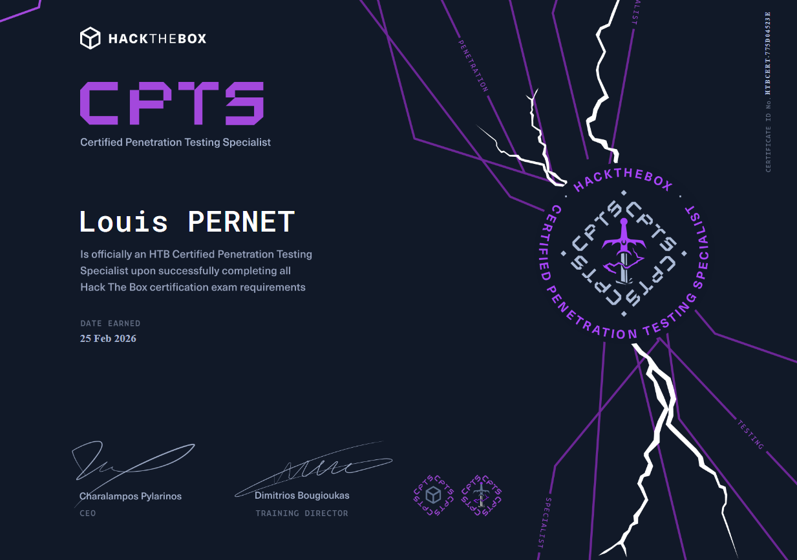

## Intro

Nouvelle étape dans mon parcours de certifs offensives : la **CPTS** (Certified Penetration Testing Specialist) de HackTheBox. Longtemps restée dans l'ombre de l'OSCP, elle s'est fait un nom ces derniers mois - à la fois pour son prix imbattable et pour un contenu qui, franchement, n'a rien à envier aux mastodontes du secteur.

Petit disclaimer avant de commencer : je bosse comme pentester (web, red team, interne), donc mon regard sur cette certif est un peu biaisé « métier ». Je ne la juge pas seulement comme un examen, mais comme un truc censé refléter ce qu'on fait vraiment sur une mission.

## C'est quoi, au juste ?

La CPTS est une certif **100 % pentest**, avec une approche large et généraliste du métier. Ce qui la démarque, c'est la qualité de son contenu, structuré autour d'un **parcours obligatoire** à compléter sur HTB Academy avant de pouvoir passer l'exam.

Le fil rouge couvre à peu près tout ce qu'on croise sur une vraie mission :

- Méthodologies et process de pentest
- Recon & information gathering
- Attaque de cibles Windows / Linux
- Active Directory (énumération + attaques)
- Pentest d'applications web
- Exploitation manuelle et automatisée
- Pivoting & lateral movement
- Post-exploitation et énumération
- Élévation de privilèges Windows / Linux
- **Communication du risque et reporting**

Le parcours « Penetration Tester » compte **28 modules**, chacun avec ses labs pratiques. Une fois le parcours bouclé, tu débloques l'accès à l'exam avec **3 tentatives** disponibles.

## Le prix

C'est là que ça devient intéressant. Pour couvrir tout le parcours CPTS, il te faut un abonnement Academy donnant accès aux modules **Tier I et Tier II**. Deux options économiques :

- **Plan étudiant** (avec une adresse mail éducative) : autour de **8 $/mois**. Le combo gagnant.
- **Silver Annual** : **~490 $/an**, et bonne nouvelle - il **inclut désormais le voucher d'examen CPTS**.

Le **voucher d'exam seul** coûte environ **210 $** (taxes comprises). Donc en mode étudiant sur 3–4 mois, tu t'en sors pour ~**240–250 $** tout compris. À ce prix-là, face à ce que demandent d'autres organismes, c'est presque indécent.

> ⚠️ Les tarifs HTB bougent régulièrement (et il y a souvent des promos genre -25 % en décembre). Vérifie la page officielle avant de sortir la CB.

## Le parcours

Les 28 modules forment le **parcours le plus long** de toutes les certifs HTB - mais c'est justifié par sa cohérence. L'idéal est de les faire **dans l'ordre, linéairement** : ils sont pensés pour empiler les compétences progressivement, même pour quelqu'un sans gros background offensif.

La devise de HTB pendant tout le parcours, c'est **« think outside the box »**, répété jusqu'à plus soif - et honnêtement, ça fait la différence, autant à l'exam que sur le terrain.

Mon avis pour bien aborder le path :

- Prends ton temps, révise ce qui doit l'être. Ce n'est pas une course.
- **Construis ta propre méthodo** : checklists, roadmap perso, cheat sheets par module. C'est ce qui te sauvera le jour J.
- Ne pars pas te disperser sur du contenu hors syllabus : le parcours couvre déjà tout ce dont tu as besoin.
- Les modules **critiques** pour l'exam : *Active Directory Enumeration & Attacks*, *Attacking Common Applications*, et surtout **Attacking Enterprise Networks** - ce dernier ressemble énormément à l'environnement de l'exam.
- Complète avec quelques machines liées à chaque module pour gagner en fluidité.

## L'examen

Le format donne le ton : quand une certif t'accorde plusieurs **jours**, c'est qu'il va t'en falloir.

- **Environnement d'entreprise en black-box**, ~8 machines (Windows et Linux).
- **14 flags** répartis dans l'environnement. Il en faut au moins **12 pour valider**.
- **10 jours** pour compromettre le lab et rendre le rapport.

Ce n'est pas un exam d'évasion / OPSEC hardcore, mais la **taille et la complexité** de l'environnement en font un vrai défi. Il faut une bonne méthodo et savoir sortir du cadre au bon moment.

Deux points rassurants d'après ce qui remonte de la commu :

- Le lab est **stable et bien construit** : tu peux bosser posément, sans la peur que quelque chose crashe.
- Le **pivoting** fait peur à beaucoup, mais si tu maîtrises **ligolo-ng**, ça devient une des parties les plus tranquilles.

## Le rapport : là où ça se joue vraiment

Le twist de la CPTS, c'est que **beaucoup finissent le lab mais ne valident pas** - parce qu'ils ratent le rapport. À la fin, on te certifie sur **la qualité du livrable**, pas sur le nombre de shells.

Mes recommandations, en tant que quelqu'un qui rédige des rapports pour de vrai :

- **Rédige au fil de l'eau**, pas à la fin. Le rapport CPTS est l'un des plus exhaustifs du monde des certifs offensives ; le laisser pour le dernier jour = mur.
- Étudie **à fond le module Documentation & Reporting** et surtout le **template officiel**. Chez HTB, on ne pardonne pas les écarts au format.
- Écris comme un **offensive engineer**, pas comme un writeup CTF : captures pertinentes, chaque étape justifiée, le **pourquoi** derrière chaque action - pas juste la liste des commandes.
- **Trace tout** : chemins des scripts uploadés, commandes utilisées, actions horodatées. Tu es un pentester mandaté, on attend un livrable pro et cohérent.
- Des outils comme **SysReport** (qui embarque le template officiel HTB) font gagner un temps fou. Mais ça ne remplace pas la lecture du module.

<!-- 💡 IMAGE : Drakeposting - "Compromettre 8 machines : facile 😎 / Rédiger le rapport de 100 pages : 💀". LE meme parfait pour la CPTS. -->
<!--  -->

## L'attente des résultats

Après soumission, comptez quelques **semaines** d'attente avant le verdict par mail. Le bon côté : en cas d'échec, tu reçois un **feedback détaillé** sur les points à améliorer, et **le lab ne change pas entre les tentatives** - si tu es bien organisé, tu reprends où tu t'étais arrêté.

<!-- 💡 IMAGE : meme "squelette qui attend" (waiting skeleton) pour l'attente des résultats. -->
<!--  -->

## Mon retour d'expérience

> ✍️ **À COMPLÉTER - ta partie perso.** Ici tu racontes ton vécu à toi : quand tu as passé l'exam, combien de flags/points, ce qui t'a bloqué, tes galères de pivoting ou d'AD, le stress de l'attente, et ton ressenti final. C'est cette section qui rendra la review authentique et différente de toutes les autres qui traînent en ligne. Je peux t'aider à la rédiger une fois que tu me donnes tes notes brutes.

## Verdict

La CPTS n'est probablement **pas une première certif** pour un total débutant : elle est dense et demande une vraie rigueur d'organisation. Mais si tu suis le parcours avec discipline et que tu t'entraînes sur quelques machines, c'est largement à ta portée.

Pour le prix, c'est à mon sens **l'une des certifs offensives les plus sous-cotées du marché**. Contenu ultra complet, exam réaliste sur plusieurs jours, et un focus reporting qui colle enfin à la réalité du métier. Elle mérite clairement sa place dans la conversation face à l'OSCP.

<!-- 💡 IMAGE : meme Spider-Man se pointant du doigt - "OSCP vs CPTS". Le débat éternel. -->
<!--  -->

Prochaine étape sur ma roadmap : **CRTE**. Mais ça, c'est pour un autre article. 👀