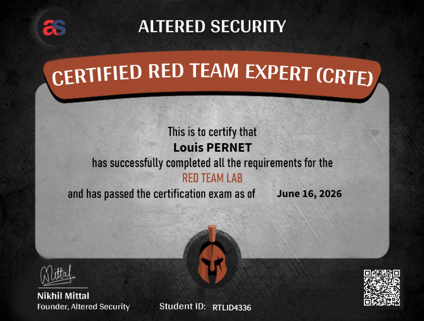

## Intro

Suite de mon parcours de certifs offensives : après la CPTS, direction l'**Active Directory pur et dur** avec la **CRTE** (Certified Red Team Expert) d'Altered Security. C'est la suite logique de la **CRTP**, un cran au-dessus, orientée environnements d'entreprise **multi-domaines et multi-forêts**.

## C'est quoi, au juste ?

La CRTE est une certif **100 % Active Directory offensif**, centrée sur l'abus de **fonctionnalités et de misconfigurations** - pas sur les CVE ou les 0-days. Tu démarres avec un simple compte utilisateur non-privilégié et tu remontes jusqu'à **Enterprise Admin sur plusieurs forêts**.

Le lab est **entièrement patché** et durci comme un vrai SI d'entreprise : Server 2025, SQL Server 2022, et des défenses actives (**Windows Defender, MDE, MDI**). Autrement dit : oublie les exploits publics, ici c'est le **feature abuse** qui fait le boulot.

Au programme, entre autres : LAPS, gMSA/dMSA, AD CS, AD Sites, intégration Azure AD (identité hybride), et surtout tout ce qui touche aux **trusts** (intra-forêt, cross-forêt, external, PAM trusts).

## Le cours

Le cours démarre par les **fondamentaux**, avec pas mal de recouvrement avec la CRTP. L'auteur l'annonce clairement dès le départ et propose un bon récap - pratique si ça fait un moment que tu n'as pas touché à l'AD.

Il y a aussi des **techniques d'évasion**. Attention cependant à ne pas surestimer cette partie : contrairement à un cours plus poussé sur le sujet comme la **CRTL de ZeroPointSecurity**, la CRTE ne rentre pas dans les détails d'implémentation, et ne les teste pas vraiment. On te fournit surtout des **outils pré-modifiés** non détectés par Defender / MDE. Le cours couvre aussi l'évasion de **MDI** - ce qui est précieux - mais ça ne semble pas évalué à l'examen.

Le vrai point fort du contenu, à mon sens : les sections sur les **attaques de trusts intra-forêt et cross-forêt**. C'est là que la CRTE se démarque de la plupart des certifs AD.

## Le lab

Franchement, le lab est **très bien conçu**. Toutes les techniques du cours sont testables dans l'environnement, chacune sous forme de **chaîne d'attaque claire**, avec les répercussions de l'abus expliquées. Ça donne une vraie valeur pratique : tu ne fais pas que reproduire une commande, tu comprends *ce que ça casse* et *pourquoi*.

Bref, je me suis vraiment amusé à le parcourir - et c'est le genre de lab qui te donne envie de creuser plus loin (lateral movement Windows, tradecraft AD, etc.).

À noter : tu peux tout à fait bosser le lab avec un **C2** si tu veux te rapprocher des conditions réelles et jouer avec le comportement des beacons, les sleeps, l'adaptation à un environnement plus surveillé mais son utilisation n'est pas primordiale.

## L'examen

C'est là que la comparaison avec la CRTP est parlante. La **CRTP** est plutôt directe : un peu d'énumération te pointe généralement vers la prochaine attaque, et les résultats te soufflent souvent la suite. Sympa pour valider, moins pour ceux qui cherchent du challenge.

La **CRTE, c'est un autre niveau**. Beaucoup **moins d'indices**, nettement plus exigeant. Suivre bêtement le support de cours sans comprendre les mécanismes sous-jacents ne te mènera pas loin. De ce point de vue, le design de l'exam est réussi.

Le format actuel :

- **~48 heures** pour compromettre un environnement **multi-forêts** entièrement patché.
- Objectif : **exécution de commandes OS** sur un ensemble de machines (historiquement, au moins 4 des 5 serveurs cibles).
- Puis **~48 heures supplémentaires** pour rendre un **rapport professionnel** - avec, pour chaque misconfiguration exploitée, les **remédiations et recommandations** associées.
- **Une tentative** incluse ; re-tentative à ~99 $ si besoin.

Côté résultats, c'est rapide : réponse reçue dès le **2e jour ouvré**, et le certificat partageable le lendemain.

> ⚠️ Altered Security **ne fournit pas de template de rapport**, mais en attend un livrable pro. Prépare ta propre structure à l'avance (un format type OSCP fonctionne très bien : résumé exécutif, puis chaque attack chain / chemin d'escalade détaillé). Ou si tu utilises un outil de reporting comme **Sysreptor** tu peux utiliser ce template: [Template sysreptor](https://github.com/Simpuar/CRTE-Sysreptor-Template/tree/main) et l'adapter à ton style. 

## Mes conseils

- **Comprends les capacités de chaque technique et de chaque outil**, pas seulement les commandes exactes montrées dans le cours.
- **Connais les types de trusts par cœur** : forest, external, PAM. Savoir ce que chacun autorise et comment l'abuser, c'est le cœur de ce qui fait la CRTE.
- **Énumère tout avant d'exploiter quoi que ce soit.** En environnement multi-forêts, c'est encore plus vrai.
- **Rédige le rapport au fil de l'eau** : notes, sorties de commandes, timeline de ton chemin. Tu te remercieras pendant la phase de reporting.
- **Fais des pauses.** Un œil frais à H+2 vaut mieux que 3 h d'énum fatiguée. Plus d'une fois, la solution saute aux yeux le lendemain matin.

## Verdict

La CRTE n'est **pas une première certif offensive** : elle ne te tient pas la main. Il faut déjà une base AD solide (CRTP, machines HTB, ou expérience terrain). Si tu l'as, c'est la **suite naturelle** pour passer au multi-domaine / multi-forêt et au tradecraft red team réaliste.

Pour un tarif de départ autour de **249–300 $**, avec un lab massif, un contenu dense et un exam vraiment exigeant, c'est **l'un des meilleurs rapports qualité-prix** du marché en AD offensif. Son seul défaut : le nom pèse moins qu'un label OffSec sur un CV - mais côté **contenu et compétences réellement transférables en mission**, elle joue clairement dans la cour des grandes.

Prochaine étape ? On verra. Mais l'envie de continuer à creuser l'AD et l'évasion est bien là. 👀