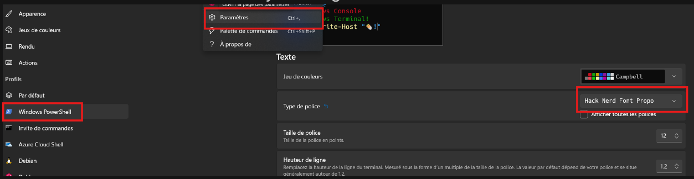
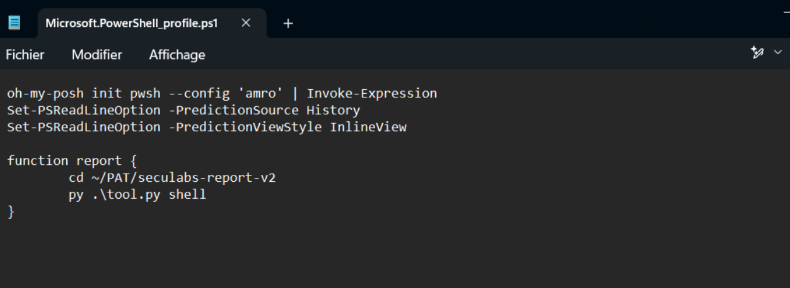

[Official documentation](https://ohmyposh.dev/docs/installation/windows)
# 1. Installation and Configuration
1. Package installation using Winget
```powershell
winget install JanDeDobbeleer.OhMyPosh --source winget
```
2. Install a [font](https://ohmyposh.dev/docs/installation/fonts)
```powershell
oh-my-posh font install # if error -> disabled the VPN
-> Then Choose your font style
```
3. Select the font on the terminal style settings

4. Choose your prompt style
https://ohmyposh.dev/docs/themes
5. Configure for permanent usage
```powershell
New-Item -Path $PROFILE -Type File -Force # Create PROFILE file if needed
notepad $PROFILE # Edit the configuration
```
```config
oh-my-posh init pwsh --config '<THEME_NAME>' | Invoke-Expression
```
# 2. Optional: Configure history prediction
```powershell
Set-PSReadLineOption -PredictionSource History
Set-PSReadLineOption -PredictionViewStyle InlineView
```
-> install PSReadLine if needed
```powershell
Install-Module PSReadLine -Force -SkipPublisherCheck
```


